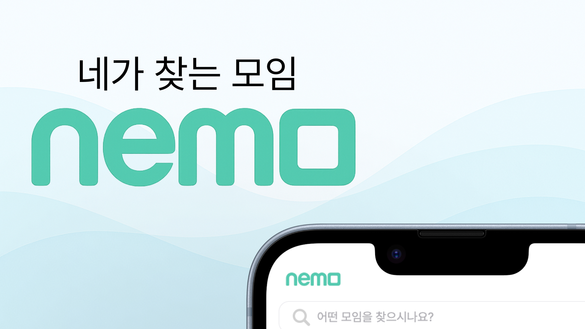
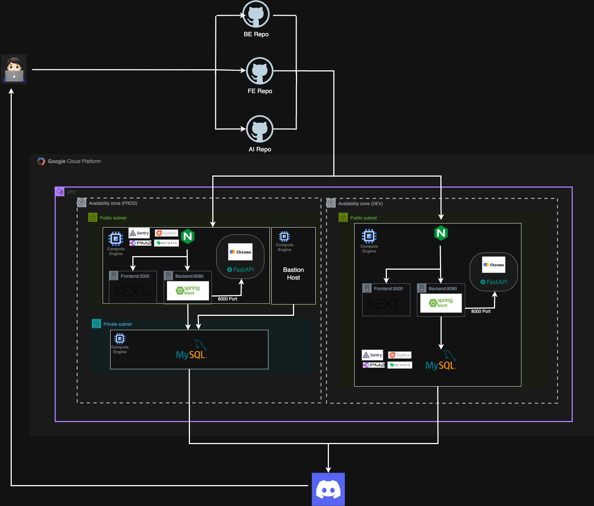
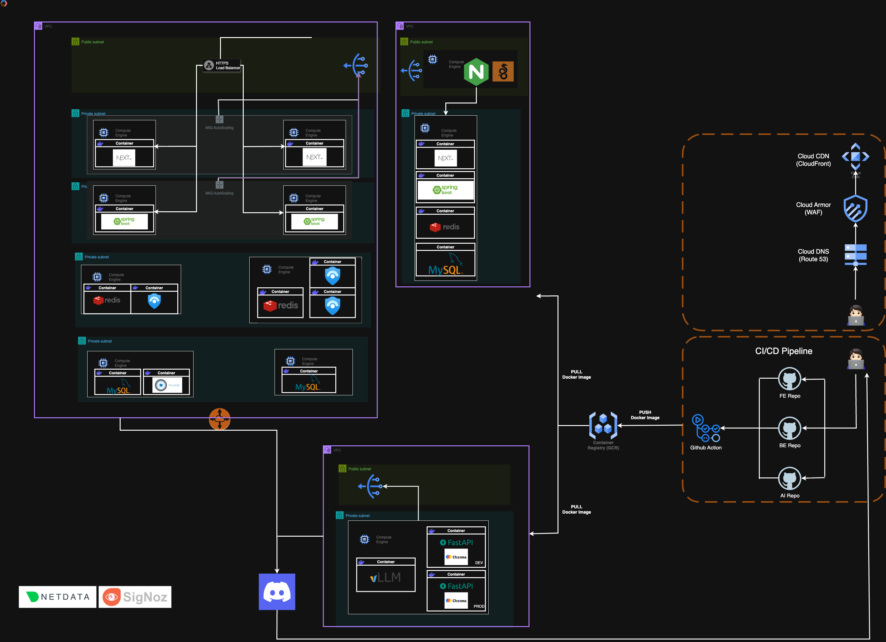
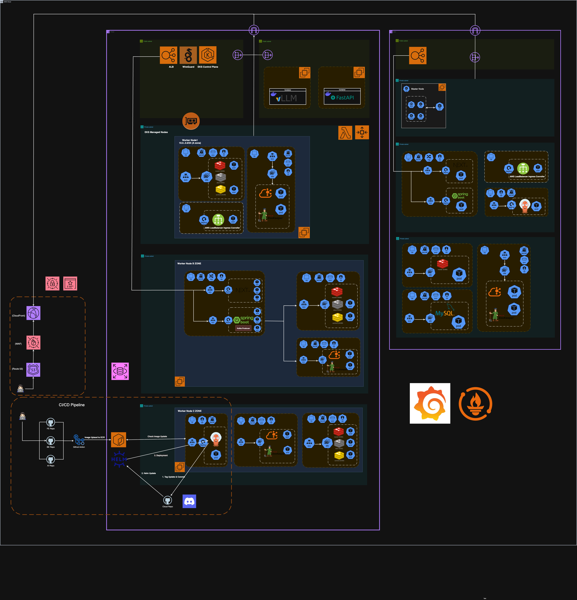

# 🌊 Nemo Cloud Infrastructure

**Cloud-Native Infrastructure Management Platform**

*Manual → Docker → Kubernetes Evolution Journey*

---

## ✨ Features

🚀 **3-Stage Evolution** - From manual deployment to full automation  
☁️ **AWS Native** - Fully managed services including EKS, RDS, ALB  
🔄 **GitOps** - Automated deployment with ArgoCD  
📊 **Full Stack** - Integrated Frontend, Backend, and AI services  

## 📈 Evolution Journey

### 🔥 v1: Manual Deployment

> **Goal**: Rapid MVP Development
> - Single VM Deployment • PM2 Manual Deployment • SigNoz Monitoring

---

### 🐳 v2: Docker Containerization  

> **Goal**: 3-Tier Architecture & Automation
> - 3-Tier Architecture • GitHub Actions CI/CD • Docker Containerization • WireGuard VPN • Netdata Monitoring

---

### ☸️ v3: Kubernetes & GitOps

> **Goal**: Enterprise-Ready Environment
> - EKS Architecture • ArgoCD GitOps • Kubernetes Adoption • Grafana + Prometheus Monitoring

## 📚 Documentation

For detailed information, please check our **[Wiki](https://github.com/100-hours-a-week/6-nemo-cloud/wiki)**!