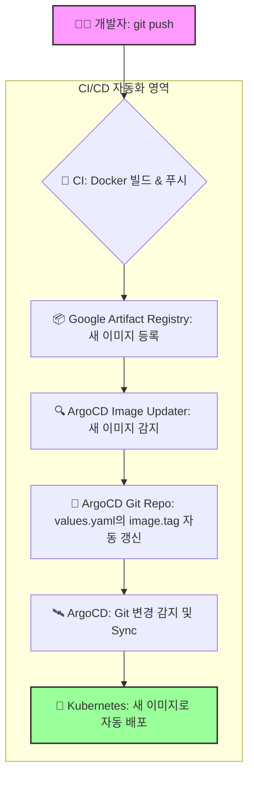

# ArgoCD Image Updater 구축 및 연동 과정 최종 정리

## 목표

- 개발자가 코드를 `git push`하면, CI가 이미지를 빌드하여 **Google Artifact Registry(GAR)**에 푸시
- **ArgoCD Image Updater**가 GAR의 새 이미지를 자동으로 감지
- ArgoCD가 관리하는 Git 저장소의 **Helm `values.yaml`** 파일 내 `image.tag`를 자동으로 갱신
- ArgoCD가 Git 변경 사항을 감지하여 Kubernetes에 **자동으로 배포**

---

## 1단계: GAR 인증용 Secret 생성

- **목표:** Kubernetes가 private 레지스트리인 GAR에 접근할 수 있도록 인증 정보 생성
- **방법:** `docker-registry` 타입의 Secret을 `app` 네임스페이스(Pod가 배포될 곳)에 생성

```sh
kubectl create secret docker-registry gar-helm-repo \
  --namespace=app \
  --docker-server=asia-northeast3-docker.pkg.dev \
  --docker-username=_json_key \
  --docker-password="$(cat gcp-service-account.json)" \
  --docker-email=<이메일>
```

---

## 2단계: Image Updater 설정 (ConfigMap)

- **목표:** Image Updater에게 GAR의 주소와 참조할 Secret의 위치를 알려줌
- **방법:** `argocd-image-updater-config` ConfigMap에 `registries.conf` 설정 추가

```yaml
# argocd-image-updater-config.yaml
apiVersion: v1
kind: ConfigMap
metadata:
  name: argocd-image-updater-config
  namespace: argocd
data:
  registries.conf: |
    registries:
      - api_url: https://asia-northeast3-docker.pkg.dev
        credentials: pullsecret:app/gar-helm-repo
        name: gcp
```

---

## 3단계: ArgoCD Application 어노테이션 설정

- **목표:** 각 Application별로 자동 업데이트할 이미지와 정책을 지정
- **방법:** `backend.yaml`, `frontend.yaml`의 `metadata.annotations`에 아래 내용 추가

```yaml
# frontend.yaml 예시
apiVersion: argoproj.io/v1alpha1
kind: Application
metadata:
  annotations:
    # 1. 감시할 이미지 경로 지정
    argocd-image-updater.argoproj.io/image-list: frontend=asia-northeast3-docker.pkg.dev/nemo-v2/registry/frontend
    # 2. 사용할 인증 Secret 지정
    argocd-image-updater.argoproj.io/frontend.pull-secret: app/gar-helm-repo
    # 3. 업데이트 전략 (latest: 최신 태그, newest-build: 최신 빌드 등)
    argocd-image-updater.argoproj.io/frontend.update-strategy: latest
    # 4. 허용할 태그 형식 (정규식)
    argocd-image-updater.argoproj.io/frontend.allow-tags: regexp:^dev3$
    # 5. 업데이트할 values.yaml 내 필드 경로
    argocd-image-updater.argoproj.io/frontend.values: image.tag
```

---

## 4단계: Helm 차트 `values.yaml` 구조

- **목표:** Image Updater가 실제로 변경할 대상 파일
- **방법:** `values.yaml`에 `image.tag` 필드를 반드시 포함

```yaml
# values.yaml 예시
image:
  name: asia-northeast3-docker.pkg.dev/nemo-v2/registry/frontend
  tag: dev3
```

---

## 전체 CI/CD 흐름



- **개발자:** 코드를 `git push`
- **CI:** Docker 이미지를 빌드하여 GAR에 푸시
- **ArgoCD Image Updater:** GAR에서 새 이미지 감지
- **ArgoCD Git Repo:** `values.yaml`의 `image.tag` 자동 갱신
- **ArgoCD:** Git 변경을 감지하고 Kubernetes와 동기화
- **Kubernetes:** 새로운 버전의 이미지로 자동 배포

---

이 과정을 통해 개발자는 코드 푸시만으로 운영 환경까지 배포를 자동화할 수 있습니다.
